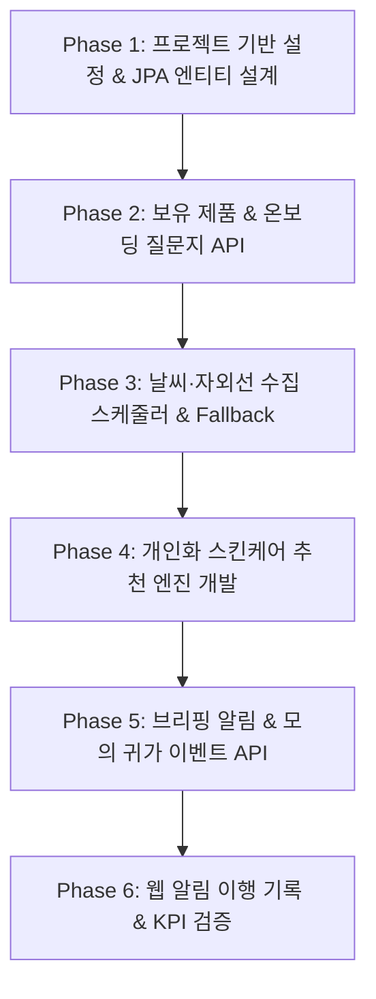

# SkinClock(스킨클락) 백엔드 기능 구현 절차 및 기술 명세서

 본 문서(`BACKEND_SPEC.md`)는 `SkinClock_SPEC.md` 요구사항 명세서를 바탕으로, **Java 25**, **Spring Boot 4.1.0**, **Spring Data JPA**, **H2 데이터베이스** 환경에서 백엔드 시스템을 단계별로 차근차근 구축하기 위한 개발 절차 및 상세 설계 명세서입니다.

---

## 1. 프로젝트 아키텍처 및 기술 스택

### 1.1 기술 스택
- **Language**: Java 25
- **Framework**: Spring Boot 4.1.0
- **ORM / Persistence**: Spring Data JPA
- **Database**: H2 Database (In-Memory MVP)
- **Build Tool**: Gradle / Maven
- **Architecture**: Layered Architecture (Controller - Service - Repository - Domain Entity)

### 1.2 패키지 구조
```text
com.skinclock.backend
├── domain
│   ├── user          // 회원 및 사용자 프로필
│   ├── product       // 보유 제품 및 사용 주기
│   ├── weather       // 날씨 & 자외선 정보 수집 및 조회
│   ├── recommendation// 개인화 추천 엔진 및 비즈니스 규칙
│   ├── notification  // 아침/귀가 브리핑 및 웹 알림
│   └── routine       // 루틴 이행 기록 및 통계
├── global
│   ├── config        // Swagger, Scheduler, JPA 설정
│   ├── exception     // 공통 예외 처리
│   └── common        // 공통 ApiResponse, BaseTimeEntity
└── external
    └── weather       // 외부 날씨/자외선 API Client & Fallback Provider
```

---

## 2. 백엔드 단계별 기능 구현 절차 (6-Phase Roadmap)



### [Phase 1] 프로젝트 공통 기반 구축 및 데이터 모델링
1. **Spring Boot 프로젝트 구조 초기화**: Java 25 & Spring Boot 4.1.0 세팅, Gradle 의존성 구성.
2. **공통 도메인 클래스 개발**: `BaseTimeEntity` (생성일시, 수정일시), 공통 `ApiResponse<T>`, 에러 핸들러 세팅.
3. **핵심 데이터베이스 엔티티 설계**: `User`, `Product`, `UserProfile`, `WeatherInfo`, `Notification`, `RoutineLog` JPA 엔티티 정의.

### [Phase 2] 회원, 보유 제품 및 질문지 프로필 API 구현 (요구사항 1, 2)
1. **보유 제품 관리 CRUD (`Product`)**:
   - 제품명, 사용 단계(클렌저, 토너, 에센스, 수분크림, 선크림, 마스크팩 등), 성분/기능 태그(레티놀, 시카, AHA/BHA, 수분 등), 사용 주기(일 단위) 등록·수정·조회·삭제.
2. **최초 질문지 및 개인 루틴 설정 (`UserProfile`)**:
   - 피부 타입(건성, 지성, 중성, 복합성, 민감성), 외출 패턴(빈도, 상주 시간, 불규칙 여부), 기본 선호 루틴 저장 및 수정.

### [Phase 3] 날씨·자외선 정보 수집 스케줄러 & Fallback 시스템 구현 (요구사항 4)
1. **외부 API Client 구현**: 외부 날씨/자외선 API (또는 Mock Provider) 연동.
2. **1시간 주기 수집 스케줄러 (`@Scheduled`)**: 매시 정각 날씨 상태, 자외선 지수(UV Index), 수집 시각 DB 저장.
3. **Fallback 메커니즘 작성**: 외부 API 장애 시 **마지막 정상 수집 데이터** $\rightarrow$ 없을 경우 **기본 쾌적 데이터(Default Mock)** 자동 반환.
4. **현재 날씨 정보 조회 API**: 사용자 추천 화면에 동기화할 수집 정보 제공.

### [Phase 4] 개인화 일일 스킨케어 추천 엔진 구현 (요구사항 3)
1. **추천 엔진 입력 파라미터 조합**: `UserProfile` + `List<Product>` + `WeatherInfo`.
2. **비즈니스 규칙 알고리즘 구현**:
   - **날씨/자외선 신호**:
     - 자외선 지수 High ($\ge 6$): 아침 선케어 및 자외선 차단 제품 필수 포함.
     - 습도 Low / 건조: 보습/영양 라인 제품 강화 및 저자극 세안 안내.
   - **성분 태그 규칙**: 레티놀/AHA 등 광과민성·고농축 성분은 저녁/귀가 루틴에 배치.
   - **주기성 제품 규칙**: 마지막 사용일 대비 사용 주기 경과 시 추천 루틴에 해당 제품 포함.
3. **면책 문구 매핑**: "본 안내는 일반적인 생활 습관 관리 정보이며 의학적 진단/치료를 대신하지 않습니다." 문구 자동 첨부.

### [Phase 5] 아침·귀가 브리핑 알림 & 모의 귀가 이벤트 API 구현 (요구사항 5)
1. **아침 브리핑 스케줄러/생성기**: 매일 아침 설정 시각에 일일 추천 결과를 기반으로 아침 브리핑 알림 생성.
2. **모의 귀가 이벤트 처리 API (`POST /api/v1/events/return-home`)**:
   - 웹 프로토타입 버튼 클릭 시 귀가 브리핑 알림 즉시 생성 (귀가 후 세안 권장 + 저녁 루틴).
3. **중복 방지 및 1일 알림 상한 컨트롤러**: 동일 유형 알림 당일 중복 발송 제어 및 피로도 방지.

### [Phase 6] 웹 알림 확인 및 루틴 이행 기록 API 구현 (요구사항 6)
1. **알림 목록 조회 & 상태 변경 API**:
   - 알림 목록 조회 (`UNREAD`, `READ`, `COMPLETED`, `POSTPONED`, `DISMISSED`).
   - 사용자의 알림 처리 상태 업데이트.
2. **루틴 이행 이력 (`RoutineLog`) 기록**:
   - 알림 완료(`COMPLETED`) 처리 시 이행 날짜, 알림 유형, 이행 시각 저장.
3. **통계 및 KPI 검증 지원**: 루틴 알림 완료율, 귀가 알림 실행 성공률 계산 쿼리 및 API 제공.

---

## 3. 데이터베이스 ERD 및 엔티티 상세 설계

```mermaid
erDiagram
    USERS ||--o| USER_PROFILES : "has"
    USERS ||--o{ PRODUCTS : "owns"
    USERS ||--o{ NOTIFICATIONS : "receives"
    USERS ||--o{ ROUTINE_LOGS : "logs"
    NOTIFICATIONS ||--o| ROUTINE_LOGS : "generates"

    USERS {
        Long id PK
        String email
        String nickname
        LocalDateTime created_at
    }

    USER_PROFILES {
        Long id PK
        Long user_id FK
        String skin_type "DRY, OILY, COMBINATION, SENSITIVE"
        String outing_pattern "REGULAR, IRREGULAR, FREQUENT"
        String base_routine_notes
        LocalDateTime updated_at
    }

    PRODUCTS {
        Long id PK
        Long user_id FK
        String name
        String step "CLEANSER, TONER, SERUM, CREAM, SUNSCREEN, PACK"
        String tags "RETINOL, CICA, AHA_BHA, MOISTURE"
        Integer usage_cycle_days "e.g. 3 (every 3 days)"
        LocalDate last_used_date
    }

    WEATHER_INFO {
        Long id PK
        String weather_status "SUNNY, CLOUDY, RAINY"
        Integer uv_index "0 to 12"
        Double temperature
        Double humidity
        LocalDateTime base_time
    }

    NOTIFICATIONS {
        Long id PK
        Long user_id FK
        String type "MORNING_BRIEFING, RETURN_HOME, CYCLE_ALERT"
        String title
        String content
        String status "UNREAD, READ, COMPLETED, POSTPONED, DISMISSED"
        LocalDateTime created_at
    }

    ROUTINE_LOGS {
        Long id PK
        Long user_id FK
        Long notification_id FK
        String routine_type
        LocalDateTime completed_at
        String status "COMPLETED"
    }
```



---

## 4. RESTful API 상세 명세서

### 4.1 보유 제품 관리 API (`/api/v1/products`)

| Method | Endpoint | 설명 | HTTP Status |
|---|---|---|---|
| `POST` | `/api/v1/products` | 보유 제품 신규 등록 | `201 Created` |
| `GET` | `/api/v1/products` | 사용자의 보유 제품 목록 조회 | `200 OK` |
| `GET` | `/api/v1/products/{id}` | 제품 상세 조회 | `200 OK` |
| `PUT` | `/api/v1/products/{id}` | 제품 정보 및 사용 주기 수정 | `200 OK` |
| `DELETE` | `/api/v1/products/{id}` | 제품 삭제 | `204 No Content` |

#### [POST] `/api/v1/products` Request Body 예시
```json
{
  "name": "레티놀 0.1% 리페어 크림",
  "step": "CREAM",
  "tags": ["RETINOL", "NIGHT_ONLY"],
  "usageCycleDays": 2
}
```

---

### 4.2 최초 질문지 및 개인 설정을 위한 API (`/api/v1/profiles`)

| Method | Endpoint | 설명 | HTTP Status |
|---|---|---|---|
| `POST` | `/api/v1/profiles` | 최초 질문지 작성 (프로필 생성) | `201 Created` |
| `GET` | `/api/v1/profiles/me` | 현재 사용자의 프로필 조회 | `200 OK` |
| `PUT` | `/api/v1/profiles/me` | 프로필 및 기본 루틴 설정 수정 | `200 OK` |

#### [POST] `/api/v1/profiles` Request Body 예시
```json
{
  "skinType": "SENSITIVE",
  "outingPattern": "IRREGULAR",
  "baseRoutineNotes": "아침에는 미온수 세안 후 자외선 차단제, 저녁에는 폼 세안 후 보습"
}
```

---

### 4.3 날씨·자외선 정보 API (`/api/v1/weather`)

| Method | Endpoint | 설명 | HTTP Status |
|---|---|---|---|
| `GET` | `/api/v1/weather/current` | 현재 적용 중인 날씨/자외선 정보 조회 | `200 OK` |
| `POST` | `/api/v1/weather/refresh` | (관리자/테스트용) 날씨 정보 수집 즉시 실행 | `200 OK` |

#### [GET] `/api/v1/weather/current` Response Body 예시
```json
{
  "weatherStatus": "SUNNY",
  "uvIndex": 8,
  "temperature": 28.5,
  "humidity": 45.0,
  "baseTime": "2026-08-14T01:00:00",
  "isFallback": false
}
```

---

### 4.4 개인화 추천 & 이벤트 모의 발생 API (`/api/v1/recommendations`, `/api/v1/events`)

| Method | Endpoint | 설명 | HTTP Status |
|---|---|---|---|
| `GET` | `/api/v1/recommendations/daily` | 오늘의 개인화 추천 루틴 조회 | `200 OK` |
| `POST` | `/api/v1/events/return-home` | (모의 입력) 귀가 이벤트 발생 및 귀가 알림 발송 | `200 OK` |

#### [GET] `/api/v1/recommendations/daily` Response Body 예시
```json
{
  "recommendationDate": "2026-08-14",
  "cleansingGuide": "자외선 지수가 높은 날입니다. 외출 후 1차 클렌징 오일 후 약산성 폼으로 세안하세요.",
  "recommendedRoutine": [
    {
      "stepOrder": 1,
      "stepName": "약산성 세안",
      "productName": "순한 약산성 클렌징폼",
      "guide": "자극 없이 노폐물만 제거합니다."
    },
    {
      "stepOrder": 2,
      "stepName": "수분 진정",
      "productName": "시카 진정 토너",
      "guide": "햇빛에 자극받은 피부를 진정시킵니다."
    },
    {
      "stepOrder": 3,
      "stepName": "주기성 특수 케어",
      "productName": "레티놀 0.1% 리페어 크림",
      "guide": "취침 전 전용 제품입니다. 저녁 루틴에만 사용하세요."
    }
  ],
  "disclaimer": "본 안내는 일반적인 생활 습관 관리 정보이며 의학적 진단이나 치료를 대신하지 않습니다."
}
```

---

### 4.5 알림 확인 및 이행 기록 API (`/api/v1/notifications`, `/api/v1/routine-logs`)

| Method | Endpoint | 설명 | HTTP Status |
|---|---|---|---|
| `GET` | `/api/v1/notifications` | 앱 내 웹 알림 목록 조회 | `200 OK` |
| `PATCH` | `/api/v1/notifications/{id}/status` | 알림 상태 업데이트 (완료/나중에/닫기) | `200 OK` |
| `GET` | `/api/v1/routine-logs` | 루틴 이행 이력 조회 | `200 OK` |

#### [PATCH] `/api/v1/notifications/{id}/status` Request Body 예시
```json
{
  "status": "COMPLETED"
}
```

---

## 5. 핵심 비즈니스 로직 및 엔진 상세 설계

### 5.1 개인화 추천 알고리즘 파이프라인
1. **사용자 환경 결합**:
   - `WeatherInfo.uvIndex >= 6` $\rightarrow$ 선케어 제품 필터링 및 아침 세안 로직 변경.
   - `WeatherInfo.humidity < 40` $\rightarrow$ 고보습/장벽 강화 크림 우선 추천.
2. **제품 성분 안전성 매핑**:
   - Tag가 `RETINOL` 또는 `AHA_BHA`인 경우 $\rightarrow$ **저녁/귀가 루틴으로 강제 분리** + "낮 시간 사용 자제" 안내 문구 추가.
3. **주기성 케어 계산**:
   - `LocalDate.now() - product.lastUsedDate >= product.usageCycleDays` 일 경우 $\rightarrow$ 오늘의 추천 제품에 자동 포함.

### 5.2 날씨 API Fallback 예외 처리 로직
```java
public WeatherInfo getOrFallbackWeather() {
    try {
        return externalWeatherClient.fetchCurrentWeather();
    } catch (Exception e) {
        log.warn("외부 날씨 API 수집 실패, DB의 최신 데이터 또는 기본값을 사용합니다.", e);
        return weatherRepository.findTopByOrderByBaseTimeDesc()
                .orElseGet(this::createDefaultFallbackWeather);
    }
}
```

---

## 6. 테스트 및 검증 계획

### 6.1 자동화 단위/통합 테스트 (JUnit 5 & AssertJ)
1. **추천 엔진 Unit Test**: UV 지수, 성분 태그, 사용 주기에 따른 추천 조합 정확성 검증.
2. **스케줄러 & Fallback Test**: 외부 API 장애 시 Mock Default Weather가 정상 작동하는지 검증.
3. **이벤트 발생 Integration Test**: `/api/v1/events/return-home` 호출 시 Notification 생성 및 이행 기록 정상 동작 확인.

### 6.2 해커톤 KPI 검증 시나리오
- **모의 귀가 입력 후 알림 생성 시간**: API 응답 속도 < 200ms 검증.
- **알림 완료 처리 후 이행 이력 저장**: `COMPLETED` 상태 변경 즉시 `RoutineLog` 생성 여부 확인.

---

 본 백엔드 기술 명세서를 바탕으로 Phase 1부터 순차적으로 백엔드 구현을 시작할 수 있습니다.
