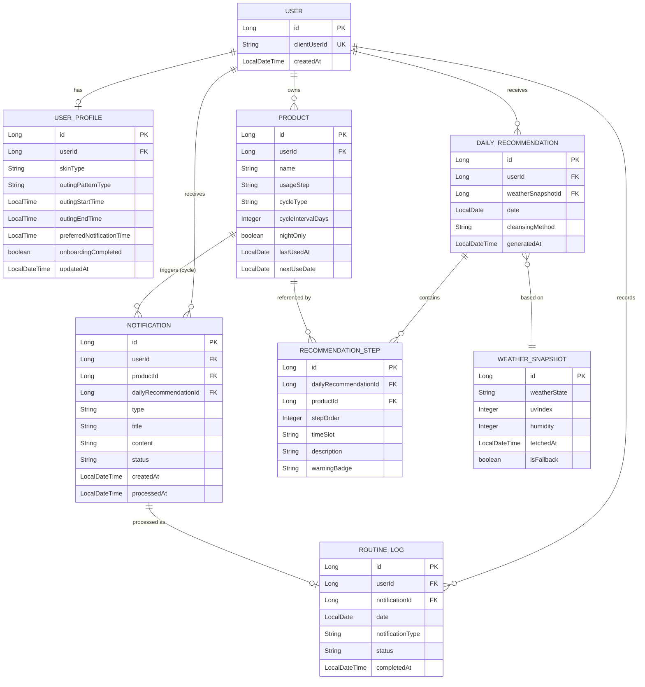

# SkinClock 백엔드 설계 문서 (ERD & API 명세)

> `IMPLEMENTATION_PLAN.md`의 **Phase 1(데이터 모델 설계)** 산출물입니다. 이후 Phase 2~7의 백엔드 구현은 이 문서의 엔티티/API를 기준으로 진행합니다. 스택: Java 25, Spring Boot 4.1.0, Spring Data JPA, H2(인메모리).

---

## 0. 공통 규약

### 0.1 인증 (MVP 간이 방식)
해커톤 MVP 범위에서는 회원가입/로그인 UI가 없으므로(FE PRD에도 로그인 화면 없음), 아래처럼 **클라이언트 발급 UUID 기반 의사(疑似) 인증**을 사용한다.

- 프론트엔드가 최초 접속 시 `crypto.randomUUID()`로 `clientUserId`를 생성해 `localStorage`에 저장
- 이후 모든 API 요청에 헤더 `X-User-Id: <clientUserId>` 를 포함
- 백엔드는 해당 헤더 값으로 `User`를 조회하고, 없으면 자동 생성(get-or-create)
- SPEC의 "관리자" 역할은 MVP 범위에서 별도 화면/API 없이 제외 (추후 확장 포인트로만 표시)

### 0.2 응답/에러 포맷
```json
// 성공
{ "data": { ... } }

// 실패
{ "error": { "code": "PRODUCT_NOT_FOUND", "message": "제품을 찾을 수 없습니다." } }
```
- HTTP 상태 코드는 표준 사용 (200/201/204/400/404/409)
- 날짜: `date` (`yyyy-MM-dd`), 시각: `dateTime` (ISO-8601 `yyyy-MM-dd'T'HH:mm:ss`)

### 0.3 면책 문구 상수
모든 추천/알림 응답에 아래 문구를 `disclaimer` 필드로 포함한다.
> "SkinClock의 안내는 일반적인 생활 습관 관리 참고용이며, 의학적 진단이나 처방을 대신하지 않습니다."

---

## 1. ERD



---

## 2. 엔티티 상세

### 2.1 User
| 필드 | 타입 | 설명 |
|---|---|---|
| id | Long | PK |
| clientUserId | String (UUID) | 프론트에서 발급, unique |
| createdAt | LocalDateTime | 최초 접속 시각 |

### 2.2 UserProfile — SPEC 기능 2
| 필드 | 타입 | 설명 |
|---|---|---|
| id | Long | PK |
| userId | FK → User | 1:1 |
| skinType | Enum: `DRY, OILY, COMBINATION, SENSITIVE, UNKNOWN` | 잘 모르겠음 선택 시 `UNKNOWN`(→내부적으로 복합성 취급) |
| outingPatternType | Enum: `REGULAR, IRREGULAR` | 외출 빈도/시간 vs 불규칙 |
| outingStartTime / outingEndTime | LocalTime (nullable) | REGULAR일 때만 사용 |
| preferredNotificationTime | LocalTime (nullable) | 아침 브리핑 등 선호 알림 시각 |
| baseRoutineItems | `Set<String>` (`@ElementCollection`) | 온보딩에서 체크한 기본 루틴 카테고리 (예: 클렌징폼, 선크림, 수분크림) |
| onboardingCompleted | boolean | 최초 질문지 완료 여부 |
| updatedAt | LocalDateTime | |

### 2.3 Product — SPEC 기능 1
| 필드 | 타입 | 설명 |
|---|---|---|
| id | Long | PK |
| userId | FK → User | |
| name | String | 제품명 |
| usageStep | Enum: `CLEANSING, TONER, ESSENCE_SERUM, CREAM, SUNCARE, MASK_PACK, OTHER` | 사용 단계 |
| ingredientTags | `Set<Enum>` (`@ElementCollection`): `RETINOL, AHA_BHA, VITAMIN_C, CICA, NEEDLE_SHOT, OTHER` | 성분·기능 태그 |
| cycleType | Enum: `DAILY, EVERY_N_DAYS, SPECIFIC_WEEKDAYS` | 사용 주기 유형 |
| cycleIntervalDays | Integer (nullable) | `EVERY_N_DAYS`일 때 N |
| cycleWeekdays | `Set<DayOfWeek>` (nullable) | `SPECIFIC_WEEKDAYS`일 때 요일 목록 |
| nightOnly | boolean | `RETINOL`/`AHA_BHA` 포함 시 저장 시점에 자동 `true` 계산 |
| lastUsedAt | LocalDate (nullable) | 마지막 사용일 |
| createdAt / updatedAt | LocalDateTime | |

> **구현 노트**: `nextUseDate`는 엔티티에 저장하지 않고 **조회 시점(`today`)마다 동적으로 계산**합니다(`NextUseDateCalculator`). DB에 저장하면 날짜가 지날 때마다 별도 배치로 갱신해야 stale해지지 않는데, 조회 시 계산하면 그 문제가 원천적으로 없어져 더 단순합니다.

**nextUseDate 계산 규칙**
- `DAILY`: 항상 오늘
- `EVERY_N_DAYS`: `lastUsedAt + cycleIntervalDays` (미사용 이력이면 오늘)
- `SPECIFIC_WEEKDAYS`: `cycleWeekdays` 중 오늘 이후 가장 가까운 요일

### 2.4 WeatherSnapshot — SPEC 기능 4
| 필드 | 타입 | 설명 |
|---|---|---|
| id | Long | PK |
| weatherState | Enum: `CLEAR, CLOUDY, RAIN, DRY` | FE 시뮬레이터(`mockWeather`)와 값 동일하게 정렬 |
| uvIndex | Integer (0~11+) | 자외선 지수 |
| humidity | Integer (nullable, %) | 습도 |
| fetchedAt | LocalDateTime | 정보 기준 시각 (수집 시각) |
| isFallback | boolean | 외부 API 실패로 기본값/캐시를 사용한 경우 `true` |

- 사용자 단위가 아닌 **전역(글로벌) 1건**을 최신값으로 유지 (지역 구분은 MVP 범위 밖, 필요 시 `regionCode` 확장 포인트로 남김)
- 매 수집마다 새 row insert (이력 보존) + "최신 1건" 조회 쿼리 사용

### 2.5 DailyRecommendation / RecommendationStep — SPEC 기능 3
| 필드 (DailyRecommendation) | 타입 | 설명 |
|---|---|---|
| id | Long | PK |
| userId | FK → User | |
| weatherSnapshotId | FK → WeatherSnapshot | 계산에 사용된 날씨 스냅샷 |
| date | LocalDate | 대상 일자 (사용자별 1일 1건, unique(userId, date)) |
| cleansingMethod | String | 권장 세안법 텍스트 |
| generatedAt | LocalDateTime | |

| 필드 (RecommendationStep) | 타입 | 설명 |
|---|---|---|
| id | Long | PK |
| dailyRecommendationId | FK | |
| productId | FK → Product (nullable) | 특정 보유 제품과 매칭되면 연결, 없으면 제품군 텍스트만 |
| stepOrder | Integer | 루틴 순서 |
| timeSlot | Enum: `MORNING, HOMECOMING, NIGHT` | 대시보드의 아침/귀가 후/취침 전 카테고리 |
| description | String | 예: "수분 크림 바르기" |
| warningBadge | String (nullable) | 예: `NIGHT_ONLY` (레티놀 등 야간 전용 경고) |

### 2.6 Notification — SPEC 기능 5
| 필드 | 타입 | 설명 |
|---|---|---|
| id | Long | PK |
| userId | FK → User | |
| productId | FK → Product (nullable) | `PRODUCT_CYCLE` 타입일 때만 |
| dailyRecommendationId | FK (nullable) | `MORNING_BRIEFING`/`HOMECOMING_BRIEFING`일 때 연결 |
| type | Enum: `MORNING_BRIEFING, HOMECOMING_BRIEFING, PRODUCT_CYCLE` | |
| title / content | String | 알림 문구 |
| status | Enum: `PENDING, COMPLETED, LATER, DISMISSED` | |
| createdAt | LocalDateTime | |
| processedAt | LocalDateTime (nullable) | 사용자가 상태를 변경한 시각 |

**중복 방지 규칙**: `(userId, type, date)` 조합으로 당일 이미 생성된 알림이 있으면 재생성하지 않음 (unique 제약 또는 생성 전 조회로 체크).

### 2.7 RoutineLog — SPEC 기능 6
| 필드 | 타입 | 설명 |
|---|---|---|
| id | Long | PK |
| userId | FK → User | |
| notificationId | FK → Notification | |
| date | LocalDate | |
| notificationType | String | 조회 편의를 위한 비정규화 컬럼 |
| status | Enum: `COMPLETED, LATER, DISMISSED` | Notification 상태 변경 시 함께 기록 |
| completedAt | LocalDateTime (nullable) | `COMPLETED`일 때만 |

- `/history` 화면의 캘린더 히트맵·스트릭 계산은 이 테이블을 날짜별로 집계해서 산출 (별도 집계 테이블 없이 쿼리로 계산, MVP 데이터량 기준 충분)

> **구현 노트 (Phase 5)**: Phase 4(WeatherSnapshot)보다 먼저 구현되어, 날씨 조회를 `TodayWeatherProvider` 인터페이스(`com.skinclock.recommendation`)로 분리하고 처음엔 `MockTodayWeatherProvider`(CLEAR, UV 7 고정)로 구현했습니다. Phase 4가 main에 merge된 뒤 `RealTodayWeatherProvider`(`com.skinclock.weather.WeatherService` 호출)로 교체 완료 — `RecommendationService`는 수정하지 않았습니다.

---

## 3. API 명세

### 3.1 사용자/온보딩 — Phase 2 (SPEC 기능 2)
| Method | Path | 설명 | 요청 Body | 응답 |
|---|---|---|---|---|
| GET | `/api/profile` | 내 개인 설정 조회 (없으면 `onboardingCompleted:false`) | - | `UserProfile` |
| POST | `/api/profile` | 최초 온보딩 저장 (upsert) | `skinType, outingPatternType, outingStartTime?, outingEndTime?, preferredNotificationTime?, baseRoutineItems[]` | `UserProfile` |
| PUT | `/api/profile` | 개인 설정 수정 | 위와 동일 (부분 필드 허용) | `UserProfile` |

### 3.2 보유 제품 — Phase 3 (SPEC 기능 1)
| Method | Path | 설명 | 요청 Body | 응답 |
|---|---|---|---|---|
| GET | `/api/products` | 내 제품 목록 조회 | - | `Product[]` |
| POST | `/api/products` | 제품 등록 | `name, usageStep, ingredientTags[], cycleType, cycleIntervalDays?, cycleWeekdays?, lastUsedAt?` | `Product` (201) |
| GET | `/api/products/{id}` | 제품 단건 조회 | - | `Product` |
| PUT | `/api/products/{id}` | 제품 수정 | 위와 동일 | `Product` |
| DELETE | `/api/products/{id}` | 제품 삭제 | - | 204 |

### 3.3 날씨·자외선 — Phase 4 (SPEC 기능 4)
| Method | Path | 설명 | 요청 Body | 응답 |
|---|---|---|---|---|
| GET | `/api/weather/current` | 현재 적용 중인 최신 날씨·자외선 정보 | - | `WeatherSnapshot` |
| POST | `/api/weather/refresh` | (데모/운영자용) 수동 즉시 재수집 트리거 | - | `WeatherSnapshot` |

- 내부적으로 `@Scheduled(fixedRate = 1h)` 배치가 외부 API 호출 → 실패 시 마지막 정상 `WeatherSnapshot`을 `isFallback=true`로 복제 저장(또는 조회 시 최신 정상값 재사용)

### 3.4 일일 추천 — Phase 5 (SPEC 기능 3)
| Method | Path | 설명 | 요청 Body | 응답 |
|---|---|---|---|---|
| GET | `/api/recommendations/today` | 오늘의 추천 조회 (없으면 즉시 생성 후 반환) | - | `DailyRecommendation` (steps 포함) |
| POST | `/api/recommendations/today/refresh` | 강제 재계산 (데모 중 UV 변경 반영용) | - | `DailyRecommendation` |

### 3.5 상황 트리거 & 브리핑 알림 — Phase 6 (SPEC 기능 5)
| Method | Path | 설명 | 요청 Body | 응답 |
|---|---|---|---|---|
| POST | `/api/situations/homecoming` | 귀가 모의 입력 → 귀가 브리핑 알림 즉시 생성 | - | `Notification` (201) |
| POST | `/api/notifications/morning-briefing/trigger` | (데모용) 아침 브리핑 즉시 생성, 실제로는 스케줄러가 `preferredNotificationTime`에 맞춰 자동 생성 | - | `Notification` (201) |

- 자동 스케줄러: 매일 사용자별 `preferredNotificationTime`(또는 기본 08:00)에 `MORNING_BRIEFING` 생성 / `Product.nextUseDate == 오늘`인 제품에 대해 `PRODUCT_CYCLE` 생성

### 3.6 알림 목록 & 이행 기록 — Phase 7 (SPEC 기능 6)
| Method | Path | 설명 | 요청 Body / Query | 응답 |
|---|---|---|---|---|
| GET | `/api/notifications` | 알림 목록 | query: `status?, type?` | `Notification[]` |
| PATCH | `/api/notifications/{id}/status` | 완료/나중에/닫힘 처리 → `RoutineLog` 기록 | `{ "status": "COMPLETED" \| "LATER" \| "DISMISSED" }` | `Notification` |
| GET | `/api/routine-logs` | 이행 기록 조회 (기간별) | query: `from, to` | `RoutineLog[]` |
| GET | `/api/routine-logs/summary` | 스트릭·월간 이행률 집계 | query: `yearMonth` | `{ streakDays, monthlyCompletionRate, dailyStatus: [{date, status}] }` |

### 3.7 (Stretch) 웹 푸시 구독
| Method | Path | 설명 | 요청 Body | 응답 |
|---|---|---|---|---|
| POST | `/api/push/subscriptions` | 브라우저 Push 구독 정보 저장 | `{ endpoint, keys: { p256dh, auth } }` | 201 |

- MVP 필수 기능은 아님(SPEC 6번은 웹 푸시를 "지원 환경에서만 보조적"으로 명시) — 시간이 부족하면 3단계 Fallback 중 인앱 알림 목록만으로 수용 기준 충족 가능

---

## 4. 다음 단계
- 이 문서의 엔티티/API를 기준으로 `IMPLEMENTATION_PLAN.md` **Phase 0(프로젝트 스캐폴딩)** 진행 시 Java/Node 실행 환경이 준비되면 바로 코드로 옮긴다.
- 코드 작성 시작 시 우선순위: `User/UserProfile` → `Product` → `WeatherSnapshot`(스케줄러) → `DailyRecommendation` → `Notification`/`RoutineLog`.
